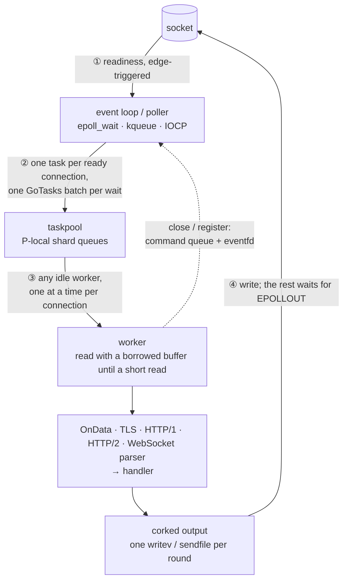

# fib — Fast In Balance

[](https://github.com/lesismal/fib/actions/workflows/ci.yml)

[English](README.md) | [简体中文](README.zh-CN.md)

fib is an event-driven networking library for Go. It covers TCP, UDP and Unix sockets, TLS,
HTTP/1.x, HTTP/2, HTTP/3 over QUIC, and WebSocket. A few event loops wait for I/O readiness,
and a shared worker pool does the work, so a connection costs no goroutine while it is idle.
HTTP handlers take the standard `*http.Request` and answer through an `http.ResponseWriter`,
which means a `net/http` handler, `http.ServeMux` or `http.FileServer` runs on fib unchanged.

The result is net/http's programming model at event-loop speed and memory. In the benchmarks
below (GitHub Actions), fib against the most-used Go servers was:

- 2.3× net/http's HTTP/1 echo throughput, and 6.9× its pipelined throughput, on a tenth of the memory
- 3.7× net/http's HTTP/2 echo throughput, and 13× its multiplexed throughput
- 3.4–5.4× quic-go's HTTP/3 throughput
- 2.9× crypto/tls over `net` in TLS 1.3 pipelining, on a third of the memory
- the highest WebSocket echo throughput of the 17 servers tested, on 32 MB

fib is also level with or close to the C, C++ and Rust servers in the same benchmarks:
uSockets, workflow, axum, h2, quiche and rustls.

- [Features](#features)
- [Quick start](#quick-start)
- [Architecture](#architecture)
- [Where the speed and the memory come from](#where-the-speed-and-the-memory-come-from)
- [Benchmarks](#benchmarks)
- [Taskpool](#taskpool)
- [Packages](#packages), [Documentation](#documentation)

## Features

### Protocols

| Protocol | Server | Client | Notes |
| --- | --- | --- | --- |
| TCP / Unix sockets | ✓ | ✓ (async dial) | `SendFile` (sendfile(2)), `writev` batching, corking, half close |
| UDP | ✓ | ✓ | batched `recvmmsg`/`sendmmsg` on Linux, one connection per peer |
| TLS 1.0–1.3 | ✓ | ✓ | crypto/tls handshakes; after the handshake, records are sealed and opened by fib itself (AES-GCM, AES-CBC) |
| HTTP/1.x | ✓ | ✓ | pipelining, chunked encoding and trailers, streaming bodies, `sendfile` for files |
| HTTP/2 | ✓ h2 and h2c | ✓ | h2c by prior knowledge or `Upgrade: h2c`, server push, h2spec in CI |
| HTTP/3 + QUIC | ✓ | ✓ | QUIC and QPACK written from scratch on `crypto/tls.QUICConn`, with no quic-go or x/net dependency |
| WebSocket | ✓ | ✓ | RFC 6455 and permessage-deflate, over HTTP/1.1, HTTP/2 (RFC 8441) and HTTP/3 (RFC 9220); Autobahn in CI |
| arpc | ✓ | ✓ | [lesismal/arpc](https://github.com/lesismal/arpc)'s wire format and API: two-way calls, notify, async calls, streams, broadcast, middleware, reconnect |
| gRPC | ✓ h2 and h2c | ✓ | unary and streaming both ways, metadata, deadlines, interceptors, gzip; works with protoc-gen-go-grpc code and talks to grpc-go |

### Engine

- **Native backends**: edge-triggered epoll on Linux, kqueue on macOS and IOCP on Windows. Other
  systems such as FreeBSD fall back to the standard `net` package.
- **Per-connection scheduling**: each connection's events run in order, one at a time, on any idle
  worker. No connection is tied to a thread, so load spreads by real work rather than by fd count.
- **Backpressure**: a per-connection write watermark (64 KiB) and a server-wide budget for pending
  bytes (1 GiB). Reads pause when either one fills, and `HoldReads` gives read-side flow control.
- **Pools**: an adaptive worker pool that grows and shrinks with load, and a size-classed buffer
  pool aligned to the Go allocator's size classes.
- **Async clients**: non-blocking dial, plus HTTP/1.x, HTTP/2, HTTP/3 and WebSocket clients that
  report results through callbacks or futures.
- **Router**: a [chi](https://github.com/go-chi/chi)-style API with parameters, regexps,
  catch-alls, groups, sub-routers and mounts. Routing allocates nothing.
- **Middleware**: compress, cors, csrf, etag, limiter, logger, pprof, recover, requestid and
  responsetime.
- **Platforms**: Linux, macOS and Windows, on amd64, arm64, 386, arm, riscv64 and loong64. Needs
  Go 1.27 or later.

## Quick start

```sh
go get github.com/lesismal/fib
```

### HTTP/1.x and HTTP/2

```go
package main

import (
	stdhttp "net/http"

	fib "github.com/lesismal/fib"
	fibhttp "github.com/lesismal/fib/http"
	"github.com/lesismal/fib/middleware"
	"github.com/lesismal/fib/middleware/logger"
	"github.com/lesismal/fib/middleware/recover"
)

func main() {
	app := fibhttp.HandlerFunc(func(c *fibhttp.Context, r *stdhttp.Request) {
		_ = c.Respond(stdhttp.StatusOK, "text/plain; charset=utf-8", []byte("hello\n"))
	})

	config := fib.DefaultConfig()
	config.Addr = "127.0.0.1:8080"
	engine, err := fib.Bind(config, fibhttp.NewHandler(middleware.Chain(app, recover.New(), logger.New())))
	if err != nil {
		panic(err)
	}
	defer engine.Close()
	if err := engine.Run(); err != nil {
		panic(err)
	}
}
```

This one handler serves HTTP/1.x and h2c on the same port.

- **TLS**: bind `fibtls.NewServer(fibhttp.ConfigureTLS(tlsConfig), fibhttp.NewHandler(app))`
  instead. HTTP/2 is then negotiated over ALPN.
- **HTTP/3**: bind a UDP engine (`config.Network = "udp"`) to `http3.NewHandler(tlsConfig, app)`,
  with the same `app`.

### Standard library `http.Handler`

`*fibhttp.Context` implements `http.ResponseWriter`, `http.Flusher`, `io.ReaderFrom` and
`io.StringWriter`, and the request is a standard `*http.Request`. A `net/http` handler is called
with the Context as its writer:

```go
mux := stdhttp.NewServeMux()
mux.HandleFunc("GET /hello/{name}", func(w stdhttp.ResponseWriter, r *stdhttp.Request) {
	fmt.Fprintf(w, "hello %s over %s\n", r.PathValue("name"), r.Proto)
})
mux.Handle("/files/", stdhttp.StripPrefix("/files/", stdhttp.FileServer(stdhttp.Dir("."))))

std := fibhttp.HandlerFunc(func(c *fibhttp.Context, r *stdhttp.Request) {
	mux.ServeHTTP(c, r) // c is the http.ResponseWriter
})
engine, err := fib.Bind(config, fibhttp.NewHandler(std))
```

Any `http.Handler` can be served this way, including chi, gorilla/mux and gin's `*gin.Engine`,
over HTTP/1.x, HTTP/2 and HTTP/3. Here is what carries over and what behaves differently:

- **Streaming**: on HTTP/1.x, `Write` and `Flush` stream the response as it is written.
- **Files**: `http.ServeFile`, `http.ServeContent` and `http.FileServer` work. On HTTP/1.x they send
  files with sendfile(2), via `ReadFrom`.
- **`http.ResponseController`** works, because Context has `FlushError`.
- **Hijacking**: `http.Hijacker` is not implemented, so libraries that hijack the connection, such
  as gorilla/websocket, do not work. Switch protocols with `Context.Upgrade` or
  `websocket.ServerHandler.Upgrade` instead.
- **Cancellation**: `r.Context()` is not cancelled when the client goes away. Use `c.OnCancel` or
  `c.Err()`.

### Router

`fibhttp.Router` has chi's API, takes fib's handlers, and is itself a `Handler`:

```go
r := fibhttp.NewRouter()
r.Use(recover.New(), logger.New()) // sees every request, 404s included
r.Get("/", index)
r.Route("/users", func(r *fibhttp.Router) {
	r.Use(auth) // only under /users
	r.Get("/{id:[0-9]+}", func(c *fibhttp.Context, req *stdhttp.Request) {
		_ = c.Respond(stdhttp.StatusOK, "text/plain", []byte("user "+c.Param("id")))
	})
	r.Get("/{id}/files/*", file) // c.Param("*") is the rest of the path
})
r.Mount("/api/{version}", apiRouter)
engine, err := fib.Bind(config, fibhttp.NewHandler(r))
```

Routes match in this order: static text first, then a parameter with a regexp, then a plain
parameter, then a catch-all. A GET route also answers HEAD. A path that exists only for other
methods gets a 405 with an `Allow` header. [`http/routerbench`](http/routerbench) compares the
router with chi and `http.ServeMux`.

### WebSocket

```go
ws := websocket.NewHandler(websocket.HandlerFuncs{
	Message: func(c *websocket.Connection, op websocket.Opcode, data []byte) {
		_ = c.WriteMessage(op, data)
	},
})
app := fibhttp.HandlerFunc(func(c *fibhttp.Context, r *stdhttp.Request) {
	if r.URL.Path == "/ws" {
		_, _ = ws.Upgrade(c, nil) // HTTP/1.1, HTTP/2 or HTTP/3, whichever the request came on
		return
	}
	_ = c.Respond(stdhttp.StatusOK, "text/plain", []byte("hello\n"))
})
```

To serve only WebSocket, bind the WebSocket handler directly:
`fib.Bind(config, websocket.NewHandlerWithConfig(cfg, handlers))`.

### arpc

```go
server := arpc.NewServer()
server.Handler.Handle("/echo", func(ctx *arpc.Context) { ctx.Write(ctx.Body()) })
engine, err := fib.Bind(config, server) // or fibtls.NewServer(tlsConfig, server)

client, err := arpc.Dial(clientEngine, "tcp", addr, 3*time.Second, nil)
var rsp string
err = client.Call("/echo", "hello", &rsp, time.Second)
```

Handlers run on the engine's handler pool, the one HTTP/2 and HTTP/3 use, unless
`Handler.SetAsyncResponse(false)` or `Handle(method, h, false)` runs them where the connection is
read, or `Handler.SetTaskPool` names another pool.

### gRPC

```go
server := grpc.NewServer()                    // grpc.TaskPool(pool) to run calls on your own pool
pb.RegisterGreeterServer(server, &greeter{})  // protoc-gen-go-grpc code, imports pointed at fib/grpc
engine, err := fib.Bind(config, server)       // h2c; fibtls.NewServer(grpc.ConfigureTLS(c), server) for TLS

conn, err := grpc.NewClient("127.0.0.1:50051", grpc.WithEngine(clientEngine))
reply, err := pb.NewGreeterClient(conn).SayHello(ctx, &pb.HelloRequest{Name: "fib"})
```

Every call runs on the engine's handler pool, the one HTTP/2 and HTTP/3 use, or on the pool the
`grpc.TaskPool` option names. Generated `_grpc.pb.go` files work once their `google.golang.org/grpc`
imports name `github.com/lesismal/fib/grpc`. fib depends on nothing outside the standard library,
so messages of google.golang.org/protobuf need a codec registered with `grpc.RegisterCodec`; the
package doc shows the five lines.

### Raw TCP

```go
config := fib.DefaultConfig()
config.Addr = "127.0.0.1:9000"
engine, err := fib.Bind(config, fib.HandlerFuncs{
	Data: func(c *fib.Connection, data []byte) { // data is only valid during the call
		if c.Send(data) != nil {
			c.Close()
		}
	},
})
```

### Examples

```sh
go run ./examples/tcp/nontls/server
go run ./examples/http/nontls/server
go run ./examples/http/router
go run ./examples/websocket/nontls/server
go run ./examples/http3/tls/server
go run ./examples/arpc/server
go run ./examples/grpc/server
```

Each server directory has a matching `client` next to it.

## Architecture

fib separates waiting for I/O from doing the work:

- **Event loops** only wait for readiness, accept connections, register and close fds, and read
  the shared UDP sockets.
- **Workers** do everything else: read, parse, run your callbacks and handlers, and write.



### Three rules

1. **Only a loop touches the poller.** Only a loop calls `epoll_ctl`, `accept` and `close`.
   Workers ask for these through a command queue and wake the loop with an eventfd.
2. **Order belongs to the connection.** Each connection folds its readiness into pending events
   and has a `scheduled` flag, so at most one worker runs it at a time, in FIFO order. For example,
   `OnClose` always comes after the `OnData` before it.
3. **No affinity.** Each round of a connection goes to whichever worker is idle, so one busy
   connection never holds up the others on its loop.

### One round of a connection

1. The loop's `epoll_wait` returns a batch of ready connections. The loop submits them to the pool
   in one `GoTasks` call, then yields.
2. A worker flushes any queued output, then reads into a buffer borrowed from the pool until a read
   comes back short.
3. It runs the protocol on the data it read (`OnData`, the HTTP parser or the WebSocket frame
   parser) and the handler.
4. Responses produced during the round are corked, and go out in one `writev` (or `sendfile`) at
   the end of the round. Whatever cannot be written stays queued, `EPOLLOUT` picks it up later, and
   past the watermark reads pause until the queue drains.

The number of pollers (`Config.IOPollers`, `IOPollerCount`) depends on the CPU count. With four
CPUs or fewer, one loop does everything. Above that, there is one poller per four CPUs, and
connections are spread over them by fd. A poller parks in Go's own netpoller rather than blocking
in `epoll_wait`, so it never holds a P while goroutines wait to run.

### Where each protocol runs

| Protocol | Loop | Engine workers | Other pools |
| --- | --- | --- | --- |
| TCP | readiness, accept | read, `OnData`, write | — |
| TLS | — | decrypt, encrypt, inner handler | `fib-tls-handshake` (handshakes) |
| HTTP/1.x | — | parse, handler, response: one round, one write | — |
| HTTP/2 | — | framing, HPACK decoding | `<Name>-streams` runs handlers, HPACK encoding and writes |
| HTTP/3 | reads UDP in batches, sorts datagrams by peer | QUIC packets, TLS 1.3, QPACK | `<Name>-streams` (handlers) |
| WebSocket | — | handshake, frames, `OnMessage`, deflate | over HTTP/2 or HTTP/3: `Upgrade` and `OnOpen` on streams |
| arpc | — | framing, responses, handlers registered sync | `<Name>-streams` (async handlers, the default) |
| gRPC | — | HTTP/2 framing, HPACK, flow control | `<Name>-streams` (every call) |

Waits only go one way, from engine workers to the other pools, so the pools cannot deadlock each
other. [docs/architecture.html](docs/architecture.html) and [docs/flows.html](docs/flows.html)
have the full picture, with one diagram per protocol.

## Where the speed and the memory come from

### Throughput

- **Batching at every step.** One `epoll_wait` returns up to 1024 events, and they reach the pool
  in one `GoTasks` call. A worker reads until a short read, then writes once per round. Pipelined
  HTTP/1 responses and WebSocket frames written in one round leave in a single `writev`. This is
  why fib does so well in the pipelined benchmarks.
- **Cheaper system calls on Linux.** Sockets are read and written with `recvfrom`, `sendto` and
  `sendmsg` through raw system calls (`Config.SocketSyscalls`, on by default). The fd is already
  non-blocking and its readiness already known, so the runtime's syscall bookkeeping is pure
  overhead.
- **A scheduler-aware worker pool.** The default taskpool queues each task on a shard owned by the
  current P, in a lock-free ring. Idle workers park on a LIFO stack, so the warmest one wakes
  first, and at most one wake-up is sent per hop rather than one per task. See
  [Taskpool](#taskpool).
- **TLS without crypto/tls on the hot path.** After crypto/tls finishes the handshake, fib takes
  over the AES-GCM (TLS 1.3/1.2) and AES-CBC (TLS 1.2/1.1) record layers, and decrypts records in
  place in the round's read buffer. ChaCha20, renegotiation and TLS 1.2 resumption stay on
  crypto/tls.
- **Protocol stacks written for this model.** HTTP/2, HPACK, QUIC, QPACK and WebSocket are
  implemented in fib. They are fed straight from the round's read buffer rather than through a
  blocking `net.Conn`, and the WebSocket parser consumes pipelined frames in place. The Router
  allocates nothing per request.

### Memory

- **No goroutine per connection.** net/http keeps at least one goroutine per connection, each with
  its own stack, plus a `bufio.Reader` and `bufio.Writer`. In fib, an idle connection is a struct
  and an entry in an fd-indexed table.
- **Buffers are borrowed for one round only.** Read and write buffers come from `bufferpool` at the
  start of a round and go back at the end, so an idle connection holds no I/O buffer at all. The
  pool's size classes match the Go allocator's, so nothing is lost to rounding. A reserve survives
  GC, so a collection does not empty the pool.
- **Bounded backlog.** The per-connection watermark and the server-wide `MaxPendingBytes` budget
  cap how much output can queue up. When either is reached, fib stops reading from the
  connections that are behind. In the HTTP/1 and WebSocket pipeline benchmarks this keeps fib at
  32–36 MB while most other servers grow to hundreds of MB.
- **TLS state is dropped after the handshake.** On the fast path, the `tls.Conn` and its input and
  handshake buffers are released, keeping only the keys and sequence numbers.
- **Opt-in object reuse for HTTP/1.** `Config.ReuseRequests`, `ReuseHeaders`, `ReuseURLs` and
  `ReuseContexts` recycle request objects, under the same lifetime rule as fasthttp.

## Benchmarks

The numbers come from the Docker benchmark workflows of the `lesismal/go-*-benchmark` repositories,
on GitHub-hosted `ubuntu-24.04` runners. Each runner has 4 vCPUs: 2 for the server and 2 for the
client. Every run uses 10,000 connections and a 1 KiB payload, and fib is at
[`4ffe768`](https://github.com/lesismal/fib/commit/4ffe768).

- **TPS** is requests (or messages) per second.
- **MEM** is the server's average RSS.
- Each is a single run, and shared runners are noisy, so read differences of a few percent as
  ties. Follow the links for the complete tables, including CPU efficiency (EER) and latency
  percentiles. Each repository's README describes its clients and how to reproduce the runs.

### HTTP/1.1: [go-http1-benchmark](https://github.com/lesismal/go-http1-benchmark) · [Actions run](https://github.com/lesismal/go-http1-benchmark/actions/runs/36839290265)

Client: Rust (tokio). Echo has one request in flight per connection. Pipeline sends 10 requests
per write, 200 per second per connection.

| Server | Echo TPS | Echo MEM | Pipeline TPS | Pipeline MEM |
| --- | ---: | ---: | ---: | ---: |
| **fib** | 194,671 | **32 MB** | **1,140,457** | **36 MB** |
| axum (Rust) | **236,244** | 227 MB | 301,804 | 490 MB |
| workflow (C++) | 150,407 | 14 MB | — ¹ | — |
| fasthttp | 139,830 | 197 MB | 692,671 | 197 MB |
| hertz | 125,451 | 399 MB | 325,226 | 524 MB |
| nbio | 92,356 | 64 MB | 185,196 | 87 MB |
| net/http | 84,739 | 314 MB | 164,811 | 323 MB |
| gin | 81,437 | 317 MB | 161,646 | 326 MB |

- **Echo**: fib is 2.30× net/http and 1.39× fasthttp, with a tenth of net/http's memory.
- **Pipeline**: fib is 6.9× net/http, 1.65× fasthttp and 3.8× axum.
- **Connections**: fib also accepts connections the fastest, at 61.8k/s, against 54.4k for axum and
  40.5k for net/http.

¹ This run produced no workflow pipeline result.

### HTTP/2 (h2c): [go-http2-benchmark](https://github.com/lesismal/go-http2-benchmark) · [Actions run](https://github.com/lesismal/go-http2-benchmark/actions/runs/36839294047)

Client: Go `x/net/http2`. Multiplex opens 10 streams at once per connection.

| Server | Echo TPS | Echo MEM | Multiplex TPS | Multiplex MEM |
| --- | ---: | ---: | ---: | ---: |
| **fib** | 129,676 | **119 MB** | **333,692** | **432 MB** |
| h2 (Rust) | **143,107** | 246 MB | 129,729 | 870 MB |
| hertz | 35,637 | 988 MB | 49,976 | 1.02 GB |
| net/http | 35,415 | 633 MB | 25,051 | 809 MB |
| gin | 35,835 | 634 MB | 26,955 | 807 MB |

- **Echo**: fib is 3.7× net/http, and at 90% of Rust's h2 it uses half h2's memory.
- **Multiplex**: fib is 13× net/http and 2.6× h2.

### HTTP/3: [go-http3-benchmark](https://github.com/lesismal/go-http3-benchmark) · [Actions run](https://github.com/lesismal/go-http3-benchmark/actions/runs/36839296383)

Client: Rust (quiche).

| Server | Echo TPS | Echo MEM | Multiplex TPS | Multiplex MEM | Handshakes/s |
| --- | ---: | ---: | ---: | ---: | ---: |
| quiche (Rust) | **72,919** | **387 MB** | **101,233** | **881 MB** | **3,128** |
| **fib** | 67,396 | 504 MB | 94,443 | 1.05 GB | 2,707 |
| quic-go | 19,545 | 1.20 GB | 17,505 | 1.80 GB | 1,819 |
| gin (quic-go) | 19,427 | 1.20 GB | 14,979 | 1.79 GB | 1,799 |

- **Echo**: fib is 3.4× quic-go, on 58% less memory.
- **Multiplex**: fib is 5.4× quic-go, on 42% less memory.
- **Against quiche**: fib reaches 92–93% of Cloudflare's quiche, but still uses more memory.

### TLS: [go-tls-benchmark](https://github.com/lesismal/go-tls-benchmark) · [Actions run](https://github.com/lesismal/go-tls-benchmark/actions/runs/36839299713)

Client: C (uSockets + BoringSSL). All servers echo plaintext.

| Server | TLS 1.3 Echo | MEM | TLS 1.3 Pipeline | MEM | TLS 1.2 Pipeline | TLS 1.1 Pipeline |
| --- | ---: | ---: | ---: | ---: | ---: | ---: |
| **fib** | 103,427 | 180 MB | 690,000 | 180 MB | 692,960 | 356,423 |
| crypto/tls + net | 92,494 | 285 MB | 241,106 | 518 MB | 245,672 | 155,931 |
| uSockets (C, BoringSSL) | 103,972 | **51 MB** | **735,000** | **51 MB** | **750,000** | **400,342** |
| rustls (Rust) | **107,406** | 110 MB | 195,835 | 201 MB | 198,465 | — |

- **Against crypto/tls over `net`**: fib echoes 12% more on 37% less memory, and pipelines
  2.3–2.9× as much on about a third of the memory.
- **Against C and Rust**: fib's echo is within 4% of uSockets and rustls. Its pipeline reaches
  89–94% of uSockets and 3.5× rustls.
- **Handshakes**: fib runs crypto/tls's handshake, so handshakes per second match crypto/tls
  (3,445 against 3,413 for TLS 1.3).

### WebSocket: [go-websocket-benchmark](https://github.com/lesismal/go-websocket-benchmark) · [Actions run](https://github.com/lesismal/go-websocket-benchmark/actions/runs/36999378687)

Client: C++ (uWebSockets).

| Server | Echo TPS | Echo MEM | Pipeline TPS | Pipeline MEM |
| --- | ---: | ---: | ---: | ---: |
| **fib** | **138,592** | 32 MB | 984,917 | 32 MB |
| uws_events | 129,363 | 41 MB | 1,072,766 | 43 MB |
| fnet | 126,401 | **28 MB** | 1,151,710 | **30 MB** |
| uws_std | 107,694 | 204 MB | **1,218,616** | 216 MB |
| gws | 124,645 | 136 MB | 205,047 | 147 MB |
| gorilla | 122,296 | 229 MB | 205,224 | 235 MB |
| nbio | 121,398 | 62 MB | 191,091 | 100 MB |
| tokio-tungstenite (Rust) | 83,841 | 105 MB | 748,297 | 286 MB |
| gobwas | 70,477 | 257 MB | 98,621 | 267 MB |

- **Echo**: fib has the highest echo throughput, and the most connections per second (32.9k), of
  the 17 servers.
- **Pipeline**: fib is 4.8× gorilla on a seventh of its memory. uws_std, fnet and uws_events are
  9–24% ahead of fib here.

The Go event-loop servers that accept a task pool run on the one the benchmark selects
(`fib_adaptive` unless set otherwise; the run's Summary lists it). See that repository's README.

## Taskpool

[`taskpool`](taskpool) is the worker pool under the engine, and it can also be used on its own.
The default, `ModeAdaptive`, works as follows:

- **Sharded by P**: a submission goes to the shard owned by the submitting goroutine's P. If that
  shard has a backlog, fib also looks at one random shard and takes the lighter of the two.
- **Lock-free queue**: each shard queues tasks in a bounded MPMC ring (Vyukov's). Submitting and
  taking a task need no lock.
- **Warm workers first**: idle workers park on a LIFO stack. Each hop wakes at most one worker, and
  no more than two are waking at a time.
- **Elastic**: the pool grows only when every worker is busy and none is on the way. Each
  `ShrinkInterval` (1s) it retires half of the workers that stayed idle the whole time.

The other modes are `ModeAdaptiveChan` (the same pool on a channel), `ModeElastic` (a goroutine
per task, with idle workers lingering) and `ModeInline`.

CI runs [`taskpool/benchmark`](taskpool/benchmark) on every push, against
[nbio](https://github.com/lesismal/nbio), [ants](https://github.com/panjf2000/ants),
[gopool](https://github.com/bytedance/gopkg) and [fnet](https://github.com/linfeip/fnet) on
Linux, macOS and Windows. The results below are the medians of
[this CI run](https://github.com/lesismal/fib/actions/runs/37020403709) (artifacts
`taskpool-benchmark-*`), in ns per task / CPU-ns per task; lower is better.

**Linux** (ubuntu-latest, 4 vCPU, AMD EPYC 9V74)

| Scenario | nbio | ants | gopool | fnet | **fib-adaptive** |
| --- | ---: | ---: | ---: | ---: | ---: |
| Handoff | 378 / 458 | **310 / 362** | 364 / 429 | 361 / 420 | 346 / 409 |
| ParallelTiny | 176 / 506 | 258 / 1,020 | 335 / 1,290 | 83.2 / 328 | **32.9 / 131** |
| LoopCPUShort | 188 / 480 | 253 / 641 | 317 / 856 | 82.5 / 326 | **75.3 / 293** |
| LoopCPULong | 608 / 2,422 | 676 / 2,620 | 610 / 2,424 | 600 / 2,385 | **581 / 2,307** |
| LoopBlocking | **298** / 931 | 498 / 1,083 | 451 / 818 | 433 / **682** | 460 / 692 |
| LoopMixed | 302 / 1,100 | 369 / 1,056 | 370 / 1,321 | 203 / 802 | **185 / 671** |
| Bursts | 245 / 1,269 | 349 / 1,405 | 396 / 1,880 | **161** / 1,011 | 173 / **817** |

**macOS** (macos-latest, 3 vCPU, Apple M1), ns per task

| Scenario | nbio | ants | gopool | fnet | **fib-adaptive** |
| --- | ---: | ---: | ---: | ---: | ---: |
| Handoff | 684 | **495** | 592 | 643 | 578 |
| ParallelTiny | 226 | 513 | 454 | 154 | **42.1** |
| LoopCPUShort | 266 | 440 | 403 | 163 | **101** |
| LoopCPULong | 1,209 | 1,908 | 1,185 | **1,072** | 1,244 |
| LoopBlocking | **356** | 560 | 380 | 447 | 483 |
| LoopMixed | 536 | 885 | 830 | 496 | **472** |
| Bursts | 1,050 | 921 | 870 | 555 | **474** |

**Windows** (windows-latest, 4 vCPU, Xeon Platinum 8573C), ns per task

| Scenario | nbio | ants | gopool | fnet | **fib-adaptive** |
| --- | ---: | ---: | ---: | ---: | ---: |
| Handoff | 1,041 | **994** | 1,138 | 1,213 | 1,119 |
| ParallelTiny | 304 | 623 | 772 | 163 | **72.5** |
| LoopCPUShort | 506 | 595 | 783 | 178 | **175** |
| LoopCPULong | 814 | 939 | 1,110 | 803 | **733** |
| LoopBlocking | 520 | 742 | 953 | **490** | **490** |
| LoopMixed | 516 | 729 | 914 | 333 | **256** |
| Bursts | 502 | 647 | 847 | 273 | **234** |

**Scenarios:**

- `Handoff`: one task at a time.
- `ParallelTiny`: every P submits empty tasks at once.
- `Loop*`: GOMAXPROCS/4 submitters act as event loops, feeding CPU-bound, sleeping or mixed tasks.
- `Bursts`: 256 tasks, then an idle gap.

**Results:**

- **Where fib-adaptive leads**: the contended and event-loop-shaped cases, `ParallelTiny`,
  `LoopCPUShort` and `LoopMixed`, on all three systems. On `ParallelTiny` it is 4–12× ahead of
  nbio, ants and gopool, and 2.2–3.7× ahead of fnet, its closest rival. It wins 4 of 7 scenarios on
  Linux and macOS, and 6 of 7 on Windows (one a tie). On Linux it also uses the least CPU per
  task in 5 of 7.
- **Where it trails**: ants wins `Handoff` (single-task latency). nbio fans out to blocking tasks
  faster on Linux and macOS (`LoopBlocking`). fnet is slightly ahead on Linux `Bursts` and macOS
  `LoopCPULong`.

Run it yourself with `cd taskpool/benchmark && ./bench.sh` (or `bench.ps1` on Windows). See its
[README](taskpool/benchmark/README.md) for the options.

## Packages

| Package | Description |
| --- | --- |
| [`fib`](.) | Engine, event loops, TCP / UDP / Unix connections, `SendFile`, async dial |
| [`taskpool`](taskpool) | Worker pools: adaptive (default), adaptive-chan, elastic, inline |
| [`bufferpool`](bufferpool) | Size-classed buffer pool aligned to the Go allocator |
| [`tls`](tls) | TLS as a layer on a connection, transparent to the protocol above it |
| [`http`](http) | HTTP/1.x and HTTP/2 server and client, Router |
| [`http3`](http3) | HTTP/3, QUIC and QPACK server and client |
| [`websocket`](websocket) | RFC 6455 server and client, permessage-deflate, upgrades over HTTP/1.1, HTTP/2 and HTTP/3 |
| [`arpc`](arpc) | [lesismal/arpc](https://github.com/lesismal/arpc) server and client, wire compatible |
| [`grpc`](grpc) | gRPC server and client over an HTTP/2 transport of its own, compatible with grpc-go and its generated code |
| [`middleware`](middleware) | Middleware chain and the common middleware |

## Documentation

- [Architecture](docs/architecture.html): event loops, pollers and pools, handler layers, read
  scheduling, write backpressure, load balancing and connection teardown
- [Protocol flows](docs/flows.html): which loop and which pool runs what for TLS, HTTP/1, HTTP/2,
  HTTP/3 and WebSocket
- [HTTP/1.x](docs/http1.md), [HTTP/2](docs/http2.md), [HTTP/3](docs/http3.md): what is supported,
  the limitations, and the conformance tests

## Build and test

```sh
go build ./...
go test ./...
```

CI also runs HTTP/1.x conformance tests against net/http and curl, h2spec, HTTP/3 interop with
quic-go, the Autobahn WebSocket suite and the fuzzers.
