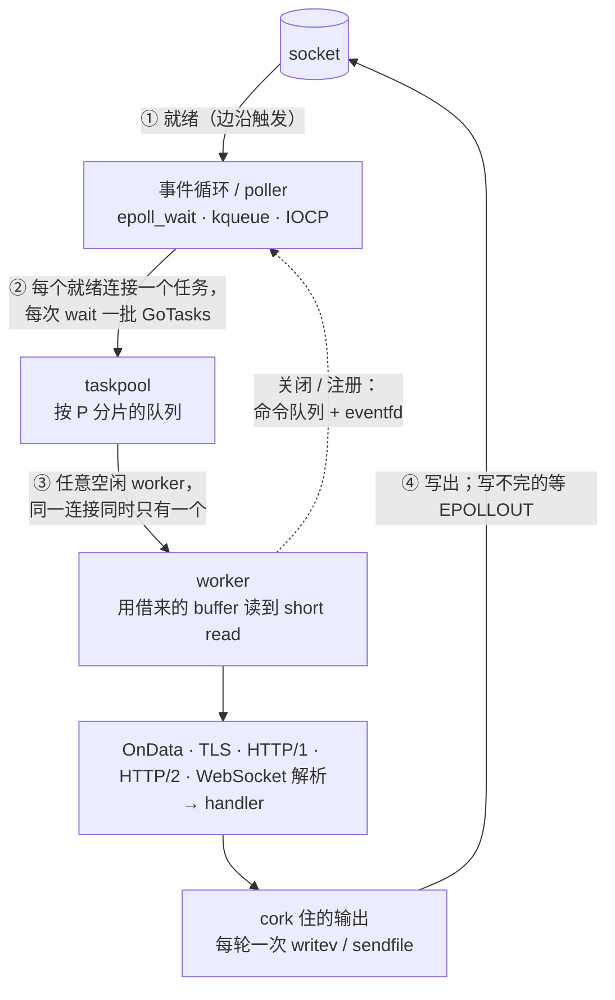

# fib — Fast In Balance

[](https://github.com/lesismal/fib/actions/workflows/ci.yml)

[English](README.md) | [简体中文](README.zh-CN.md)

fib 是一个事件驱动的 Go 网络库，支持 TCP、UDP、Unix socket、TLS、HTTP/1.x、HTTP/2、基于 QUIC 的
HTTP/3 和 WebSocket。少量事件循环负责等待 I/O 就绪，具体工作交给共享的 worker 协程池，所以连接
不占用 goroutine，空闲连接几乎没有开销。HTTP handler 接收标准库的 `*http.Request`，通过
`http.ResponseWriter` 回写，因此 `net/http` 的 handler、`http.ServeMux`、`http.FileServer` 不用改动
就能跑在 fib 上。

也就是说：编程模型和 net/http 一样，性能和内存是事件循环的水平。在下文的 GitHub Actions 基准测试
里，和最常用的 Go 实现相比：

- HTTP/1：echo 吞吐是 net/http 的 2.3 倍，pipeline 吞吐是 6.9 倍，内存只有它的十分之一
- HTTP/2：echo 吞吐是 net/http 的 3.7 倍，多路复用吞吐是 13 倍
- HTTP/3：吞吐是 quic-go 的 3.4–5.4 倍
- TLS 1.3 pipeline：吞吐是 crypto/tls + `net` 的 2.9 倍，内存约为三分之一
- WebSocket：echo 吞吐在参测的 17 个服务端中最高，内存 32 MB

同一组测试里，fib 也与 C、C++、Rust 实现（uSockets、workflow、axum、h2、quiche、rustls）持平或接近。

- [特性](#特性)
- [快速开始](#快速开始)
- [架构](#架构)
- [性能与内存从哪里来](#性能与内存从哪里来)
- [基准测试](#基准测试)
- [Taskpool](#taskpool)
- [包](#包)、[文档](#文档)

## 特性

### 协议

| 协议 | 服务端 | 客户端 | 说明 |
| --- | --- | --- | --- |
| TCP / Unix socket | ✓ | ✓（异步 dial） | `SendFile`（sendfile(2)）、`writev` 批量写、cork、半关闭 |
| UDP | ✓ | ✓ | Linux 上用 `recvmmsg`/`sendmmsg` 批量收发，每个对端一个连接 |
| TLS 1.0–1.3 | ✓ | ✓ | 握手用 crypto/tls；握手完成后由 fib 自己加解密记录（AES-GCM、AES-CBC） |
| HTTP/1.x | ✓ | ✓ | pipelining、chunked 与 trailer、流式 body、文件走 `sendfile` |
| HTTP/2 | ✓ h2 与 h2c | ✓ | h2c 支持 prior knowledge 和 `Upgrade: h2c`，支持 server push，CI 跑 h2spec |
| HTTP/3 + QUIC | ✓ | ✓ | QUIC 和 QPACK 基于 `crypto/tls.QUICConn` 自行实现，不依赖 quic-go 或 x/net |
| WebSocket | ✓ | ✓ | RFC 6455、permessage-deflate，可经 HTTP/1.1、HTTP/2（RFC 8441）、HTTP/3（RFC 9220）升级；CI 跑 Autobahn |
| arpc | ✓ | ✓ | 与 [lesismal/arpc](https://github.com/lesismal/arpc) 相同的协议格式和 API：双向调用、notify、异步调用、stream、广播、中间件、断线重连 |
| gRPC | ✓ h2 和 h2c | ✓ | unary 与双向 streaming、metadata、deadline、拦截器、gzip；可直接用 protoc-gen-go-grpc 生成的代码，与 grpc-go 互通 |

### 引擎

- **原生后端**：Linux 用边沿触发的 epoll，macOS 用 kqueue，Windows 用 IOCP。FreeBSD 等其他系统
  回退到标准库 `net`。
- **按连接调度**：同一连接的事件按顺序、一次一个地在任意空闲 worker 上执行。连接不绑定线程，
  负载按实际工作量分摊，而不是按 fd 数量。
- **背压**：每连接有写水位线（64 KiB），全服务有待发字节预算（1 GiB），任一满了就暂停读取；
  `HoldReads` 提供读端流控。
- **池**：随负载伸缩的自适应 worker 池；按 Go 分配器 size class 对齐的分级 buffer 池。
- **异步客户端**：非阻塞 dial，以及 HTTP/1.x、HTTP/2、HTTP/3、WebSocket 客户端，结果通过回调或
  future 返回。
- **Router**：[chi](https://github.com/go-chi/chi) 风格的 API，支持参数、正则、通配、分组、
  子路由和挂载，路由过程零分配。
- **中间件**：compress、cors、csrf、etag、limiter、logger、pprof、recover、requestid、
  responsetime。
- **平台**：Linux、macOS、Windows，支持 amd64、arm64、386、arm、riscv64、loong64，需要 Go 1.27
  或更新版本。

## 快速开始

```sh
go get github.com/lesismal/fib
```

### HTTP/1.x 与 HTTP/2

```go
package main

import (
	stdhttp "net/http"

	fib "github.com/lesismal/fib"
	fibhttp "github.com/lesismal/fib/http"
	"github.com/lesismal/fib/middleware"
	"github.com/lesismal/fib/middleware/logger"
	"github.com/lesismal/fib/middleware/recover"
)

func main() {
	app := fibhttp.HandlerFunc(func(c *fibhttp.Context, r *stdhttp.Request) {
		_ = c.Respond(stdhttp.StatusOK, "text/plain; charset=utf-8", []byte("hello\n"))
	})

	config := fib.DefaultConfig()
	config.Addr = "127.0.0.1:8080"
	engine, err := fib.Bind(config, fibhttp.NewHandler(middleware.Chain(app, recover.New(), logger.New())))
	if err != nil {
		panic(err)
	}
	defer engine.Close()
	if err := engine.Run(); err != nil {
		panic(err)
	}
}
```

这一个 handler 在同一端口上同时提供 HTTP/1.x 和 h2c。

- **TLS**：改为 bind `fibtls.NewServer(fibhttp.ConfigureTLS(tlsConfig), fibhttp.NewHandler(app))`，
  HTTP/2 通过 ALPN 协商。
- **HTTP/3**：用一个 UDP engine（`config.Network = "udp"`）bind `http3.NewHandler(tlsConfig, app)`，
  `app` 不变。

### 兼容标准库 `http.Handler`

`*fibhttp.Context` 实现了 `http.ResponseWriter`、`http.Flusher`、`io.ReaderFrom` 和
`io.StringWriter`，请求就是标准库的 `*http.Request`。把 Context 当作 writer 传给 `net/http` 的
handler 即可：

```go
mux := stdhttp.NewServeMux()
mux.HandleFunc("GET /hello/{name}", func(w stdhttp.ResponseWriter, r *stdhttp.Request) {
	fmt.Fprintf(w, "hello %s over %s\n", r.PathValue("name"), r.Proto)
})
mux.Handle("/files/", stdhttp.StripPrefix("/files/", stdhttp.FileServer(stdhttp.Dir("."))))

std := fibhttp.HandlerFunc(func(c *fibhttp.Context, r *stdhttp.Request) {
	mux.ServeHTTP(c, r) // c 就是 http.ResponseWriter
})
engine, err := fib.Bind(config, fibhttp.NewHandler(std))
```

任何 `http.Handler` 都可以这样接入，包括 chi、gorilla/mux 和 gin 的 `*gin.Engine`，在 HTTP/1.x、
HTTP/2、HTTP/3 上都适用。兼容的部分与行为不同的部分：

- **流式输出**：HTTP/1.x 上 `Write` + `Flush` 边写边发。
- **文件**：`http.ServeFile`、`http.ServeContent`、`http.FileServer` 都能用；在 HTTP/1.x 上通过
  `ReadFrom` 走 sendfile(2)。
- **`http.ResponseController`** 可用，因为 Context 实现了 `FlushError`。
- **Hijack**：没有实现 `http.Hijacker`，所以需要 hijack 连接的库（如 gorilla/websocket）不能用。
  切换协议请用 `Context.Upgrade` 或 `websocket.ServerHandler.Upgrade`。
- **取消**：客户端断开时 `r.Context()` 不会被取消，请用 `c.OnCancel` 或 `c.Err()`。

### 路由

`fibhttp.Router` 沿用 chi 的 API，handler 用 fib 自己的格式，Router 本身也是一个 `Handler`：

```go
r := fibhttp.NewRouter()
r.Use(recover.New(), logger.New()) // 所有请求都经过，包括 404
r.Get("/", index)
r.Route("/users", func(r *fibhttp.Router) {
	r.Use(auth) // 只作用于 /users 下
	r.Get("/{id:[0-9]+}", func(c *fibhttp.Context, req *stdhttp.Request) {
		_ = c.Respond(stdhttp.StatusOK, "text/plain", []byte("user "+c.Param("id")))
	})
	r.Get("/{id}/files/*", file) // c.Param("*") 是路径的剩余部分
})
r.Mount("/api/{version}", apiRouter)
engine, err := fib.Bind(config, fibhttp.NewHandler(r))
```

匹配优先级依次是：静态文本、带正则的参数、普通参数、通配。GET 路由同时响应 HEAD。路径存在但方法
不匹配时返回 405，并带 `Allow` 头。[`http/routerbench`](http/routerbench) 有与 chi、
`http.ServeMux` 的对比。

### WebSocket

```go
ws := websocket.NewHandler(websocket.HandlerFuncs{
	Message: func(c *websocket.Connection, op websocket.Opcode, data []byte) {
		_ = c.WriteMessage(op, data)
	},
})
app := fibhttp.HandlerFunc(func(c *fibhttp.Context, r *stdhttp.Request) {
	if r.URL.Path == "/ws" {
		_, _ = ws.Upgrade(c, nil) // 请求来自 HTTP/1.1、HTTP/2 还是 HTTP/3 都可以
		return
	}
	_ = c.Respond(stdhttp.StatusOK, "text/plain", []byte("hello\n"))
})
```

只提供 WebSocket 时，可以直接 bind WebSocket handler：
`fib.Bind(config, websocket.NewHandlerWithConfig(cfg, handlers))`。

### arpc

```go
server := arpc.NewServer()
server.Handler.Handle("/echo", func(ctx *arpc.Context) { ctx.Write(ctx.Body()) })
engine, err := fib.Bind(config, server) // 或 fibtls.NewServer(tlsConfig, server)

client, err := arpc.Dial(clientEngine, "tcp", addr, 3*time.Second, nil)
var rsp string
err = client.Call("/echo", "hello", &rsp, time.Second)
```

handler 默认在 engine 的 handler 池（与 HTTP/2、HTTP/3 相同的 streams 池）上异步执行；
`Handler.SetAsyncResponse(false)` 全局、`Handle(method, h, false)` 单个方法改为在读连接的 worker 上同步执行，
`Handler.SetTaskPool` 可以换成自己的协程池。

### gRPC

```go
server := grpc.NewServer()                    // grpc.TaskPool(pool) 可改用自己的协程池
pb.RegisterGreeterServer(server, &greeter{})  // protoc-gen-go-grpc 生成的代码，import 改指向 fib/grpc
engine, err := fib.Bind(config, server)       // h2c；TLS 用 fibtls.NewServer(grpc.ConfigureTLS(c), server)

conn, err := grpc.NewClient("127.0.0.1:50051", grpc.WithEngine(clientEngine))
reply, err := pb.NewGreeterClient(conn).SayHello(ctx, &pb.HelloRequest{Name: "fib"})
```

每个调用都在 engine 的 handler 池（与 HTTP/2、HTTP/3 相同的 streams 池）上执行，配置了
`grpc.TaskPool` 时则用用户的池。生成的 `_grpc.pb.go` 只需把 `google.golang.org/grpc` 的 import
改为 `github.com/lesismal/fib/grpc`。fib 不依赖标准库以外的模块，所以 google.golang.org/protobuf
的消息需要用 `grpc.RegisterCodec` 注册一个 codec，包文档里有这五行代码。

### 裸 TCP

```go
config := fib.DefaultConfig()
config.Addr = "127.0.0.1:9000"
engine, err := fib.Bind(config, fib.HandlerFuncs{
	Data: func(c *fib.Connection, data []byte) { // data 只在本次回调内有效
		if c.Send(data) != nil {
			c.Close()
		}
	},
})
```

### 示例

```sh
go run ./examples/tcp/nontls/server
go run ./examples/http/nontls/server
go run ./examples/http/router
go run ./examples/websocket/nontls/server
go run ./examples/arpc/server
go run ./examples/grpc/server
go run ./examples/http3/tls/server
```

每个 server 目录旁边都有对应的 `client`。

## 架构

fib 把“等待 I/O”和“干活”分开：

- **事件循环**只负责等待就绪、accept、注册和关闭 fd，以及读共享的 UDP socket。
- **worker** 负责其余一切：读、解析、执行回调和 handler、写。



### 三条规则

1. **只有事件循环操作 poller。** 只有事件循环调用 `epoll_ctl`、`accept`、`close`；worker 通过
   命令队列提出请求，并用 eventfd 唤醒事件循环。
2. **顺序归连接所有。** 每个连接把就绪事件合并进待处理事件，并有一个 `scheduled` 标记，保证同一
   时刻最多一个 worker 在处理它，按 FIFO 顺序执行。例如 `OnClose` 一定在它之前的 `OnData` 之后。
3. **不绑定线程。** 连接的每一轮交给当时空闲的 worker，一个繁忙的连接不会拖住同一事件循环上的
   其他连接。

### 连接的一轮处理

1. 事件循环的 `epoll_wait` 返回一批就绪连接，一次 `GoTasks` 提交给池，然后让出 CPU。
2. worker 先 flush 排队的输出，再用从池里借来的 buffer 读，直到读到 short read。
3. 对读到的数据执行协议层（`OnData`、HTTP 解析器或 WebSocket 帧解析器）和 handler。
4. 本轮产生的响应先 cork，在本轮结束时用一次 `writev`（或 `sendfile`）发出。写不完的部分留在
   队列里，由 `EPOLLOUT` 继续；超过水位线时暂停读取，直到队列排空。

poller 数量（`Config.IOPollers`、`IOPollerCount`）取决于 CPU 数：4 核及以下由一个事件循环包办；
4 核以上每 4 个 CPU 一个 poller，连接按 fd 分配。poller 停在 Go 自己的 netpoller 里，而不是阻塞在
`epoll_wait` 上，所以不会在有 goroutine 等待运行时占着 P。

### 各协议在哪里执行

| 协议 | 事件循环 | engine worker | 其他池 |
| --- | --- | --- | --- |
| TCP | 就绪、accept | 读、`OnData`、写 | — |
| TLS | — | 解密、加密、内层 handler | `fib-tls-handshake`（握手） |
| HTTP/1.x | — | 解析、handler、响应：一轮完成、一次写 | — |
| HTTP/2 | — | 分帧、HPACK 解码 | `<Name>-streams` 执行 handler、HPACK 编码和写 |
| HTTP/3 | 批量读 UDP、按对端分拣数据报 | QUIC 包、TLS 1.3、QPACK | `<Name>-streams`（handler） |
| WebSocket | — | 握手、帧、`OnMessage`、deflate | 经 HTTP/2 或 HTTP/3 时：`Upgrade` 和 `OnOpen` 在 streams 池 |
| arpc | — | 拆包、响应、注册为同步的 handler | `<Name>-streams`（异步 handler，默认） |
| gRPC | — | HTTP/2 分帧、HPACK、流控 | `<Name>-streams`（所有调用） |

等待只有一个方向：从 engine worker 到其他池，所以池之间不会互相死锁。完整说明和每个协议的流程图见
[docs/architecture.zh-CN.html](docs/architecture.zh-CN.html) 和
[docs/flows.zh-CN.html](docs/flows.zh-CN.html)。

## 性能与内存从哪里来

### 吞吐

- **每一步都批量。** 一次 `epoll_wait` 最多返回 1024 个事件，一次 `GoTasks` 交给池；worker 读到
  short read 为止，每轮只写一次。同一轮内写出的 pipeline HTTP/1 响应和 WebSocket 帧合并成一次
  `writev`。这正是 fib 在 pipeline 测试里表现突出的原因。
- **Linux 上更便宜的系统调用。** socket 用 `recvfrom`、`sendto`、`sendmsg` 的原始系统调用读写
  （`Config.SocketSyscalls`，默认开启）。fd 已经是非阻塞的、就绪状态也已知，runtime 的 syscall
  记账纯属额外开销。
- **感知调度器的 worker 池。** 默认 taskpool 把任务放进当前 P 所属分片的无锁环形队列；空闲 worker
  停在 LIFO 栈上，最热的先被唤醒；每一跳最多唤醒一个，而不是每个任务唤醒一个。见
  [Taskpool](#taskpool)。
- **热路径上不经过 crypto/tls。** crypto/tls 完成握手后，fib 接管 AES-GCM（TLS 1.3/1.2）和
  AES-CBC（TLS 1.2/1.1）记录层，直接在本轮读 buffer 上原地解密。ChaCha20、重协商和 TLS 1.2 会话
  恢复仍走 crypto/tls。
- **为这个模型而写的协议栈。** HTTP/2、HPACK、QUIC、QPACK、WebSocket 都由 fib 自己实现，直接从
  本轮读 buffer 取数据，而不是经过阻塞的 `net.Conn`；WebSocket 解析器原地消费 pipeline 的帧。
  Router 每个请求零分配。

### 内存

- **没有每连接 goroutine。** net/http 每个连接至少一个 goroutine，各有自己的栈，外加
  `bufio.Reader` 和 `bufio.Writer`。fib 的空闲连接只是一个结构体加 fd 索引表里的一项。
- **buffer 只借用一轮。** 读写 buffer 在一轮开始时从 `bufferpool` 取、结束时归还，空闲连接不持有
  任何 I/O buffer。池的 size class 与 Go 分配器一致，没有取整浪费；还有一份能扛过 GC 的储备，
  GC 不会把池清空。
- **有上限的积压。** 每连接水位线和全服务 `MaxPendingBytes` 预算限制排队输出的总量，达到任一
  上限就停止读取落后的连接。在 HTTP/1 和 WebSocket 的 pipeline 测试中，fib 因此保持在 32–36 MB，
  而多数其他实现涨到几百 MB。
- **握手后丢弃 TLS 状态。** 快速路径上，`tls.Conn` 及其输入和握手 buffer 都被释放，只保留密钥和
  序列号。
- **HTTP/1 默认复用对象。** `Config.ReuseRequests`、`ReuseHeaders`、`ReuseURLs`、
  `ReuseContexts` 复用请求对象，生命周期规则与 fasthttp、Fiber 相同，每项都可以关闭。
  `Context.Body`、`Context.Query` 不拷贝地读取 body 与 query。

## 基准测试

数据来自 `lesismal/go-*-benchmark` 各仓库的 Docker benchmark workflow，运行在 GitHub 托管的
`ubuntu-24.04` runner 上。每台 runner 4 个 vCPU：服务端 2 个，客户端 2 个。每次测试 10,000 个连接、
1 KiB 负载，fib 版本为 [`4ffe768`](https://github.com/lesismal/fib/commit/4ffe768)。

- **TPS** 是每秒请求（或消息）数。
- **MEM** 是服务端平均 RSS。
- 每项都是单次运行，共享 runner 有噪声，几个百分点的差距应视为持平。完整表格（含 CPU 效率 EER 和
  延迟分位数）见各链接；客户端说明和复现方法见各仓库 README。

### HTTP/1.1：[go-http1-benchmark](https://github.com/lesismal/go-http1-benchmark) · [Actions run](https://github.com/lesismal/go-http1-benchmark/actions/runs/36839290265)

客户端：Rust（tokio）。Echo 每连接同时一个请求；Pipeline 每次写 10 个请求，每连接每秒 200 个。

| 服务端 | Echo TPS | Echo MEM | Pipeline TPS | Pipeline MEM |
| --- | ---: | ---: | ---: | ---: |
| **fib** | 194,671 | **32 MB** | **1,140,457** | **36 MB** |
| axum (Rust) | **236,244** | 227 MB | 301,804 | 490 MB |
| workflow (C++) | 150,407 | 14 MB | — ¹ | — |
| fasthttp | 139,830 | 197 MB | 692,671 | 197 MB |
| hertz | 125,451 | 399 MB | 325,226 | 524 MB |
| nbio | 92,356 | 64 MB | 185,196 | 87 MB |
| net/http | 84,739 | 314 MB | 164,811 | 323 MB |
| gin | 81,437 | 317 MB | 161,646 | 326 MB |

- **Echo**：fib 是 net/http 的 2.30 倍、fasthttp 的 1.39 倍，内存是 net/http 的十分之一。
- **Pipeline**：fib 是 net/http 的 6.9 倍、fasthttp 的 1.65 倍、axum 的 3.8 倍。
- **建连**：fib 建连也最快，61.8k/s，axum 54.4k，net/http 40.5k。

¹ 本次运行没有产出 workflow 的 pipeline 结果。

### HTTP/2（h2c）：[go-http2-benchmark](https://github.com/lesismal/go-http2-benchmark) · [Actions run](https://github.com/lesismal/go-http2-benchmark/actions/runs/36839294047)

客户端：Go `x/net/http2`。Multiplex 每连接同时开 10 个 stream。

| 服务端 | Echo TPS | Echo MEM | Multiplex TPS | Multiplex MEM |
| --- | ---: | ---: | ---: | ---: |
| **fib** | 129,676 | **119 MB** | **333,692** | **432 MB** |
| h2 (Rust) | **143,107** | 246 MB | 129,729 | 870 MB |
| hertz | 35,637 | 988 MB | 49,976 | 1.02 GB |
| net/http | 35,415 | 633 MB | 25,051 | 809 MB |
| gin | 35,835 | 634 MB | 26,955 | 807 MB |

- **Echo**：fib 是 net/http 的 3.7 倍；达到 Rust h2 的 90%，内存只有它的一半。
- **Multiplex**：fib 是 net/http 的 13 倍、h2 的 2.6 倍。

### HTTP/3：[go-http3-benchmark](https://github.com/lesismal/go-http3-benchmark) · [Actions run](https://github.com/lesismal/go-http3-benchmark/actions/runs/36839296383)

客户端：Rust（quiche）。

| 服务端 | Echo TPS | Echo MEM | Multiplex TPS | Multiplex MEM | 握手/秒 |
| --- | ---: | ---: | ---: | ---: | ---: |
| quiche (Rust) | **72,919** | **387 MB** | **101,233** | **881 MB** | **3,128** |
| **fib** | 67,396 | 504 MB | 94,443 | 1.05 GB | 2,707 |
| quic-go | 19,545 | 1.20 GB | 17,505 | 1.80 GB | 1,819 |
| gin (quic-go) | 19,427 | 1.20 GB | 14,979 | 1.79 GB | 1,799 |

- **Echo**：fib 是 quic-go 的 3.4 倍，内存少 58%。
- **Multiplex**：fib 是 quic-go 的 5.4 倍，内存少 42%。
- **对比 quiche**：fib 达到 Cloudflare quiche 的 92–93%，但内存仍比它高。

### TLS：[go-tls-benchmark](https://github.com/lesismal/go-tls-benchmark) · [Actions run](https://github.com/lesismal/go-tls-benchmark/actions/runs/36839299713)

客户端：C（uSockets + BoringSSL）。所有服务端都回显明文。

| 服务端 | TLS 1.3 Echo | MEM | TLS 1.3 Pipeline | MEM | TLS 1.2 Pipeline | TLS 1.1 Pipeline |
| --- | ---: | ---: | ---: | ---: | ---: | ---: |
| **fib** | 103,427 | 180 MB | 690,000 | 180 MB | 692,960 | 356,423 |
| crypto/tls + net | 92,494 | 285 MB | 241,106 | 518 MB | 245,672 | 155,931 |
| uSockets (C, BoringSSL) | 103,972 | **51 MB** | **735,000** | **51 MB** | **750,000** | **400,342** |
| rustls (Rust) | **107,406** | 110 MB | 195,835 | 201 MB | 198,465 | — |

- **对比 crypto/tls + `net`**：fib 的 echo 高 12%、内存少 37%；pipeline 是它的 2.3–2.9 倍，内存约为
  三分之一。
- **对比 C 和 Rust**：fib 的 echo 与 uSockets、rustls 相差不到 4%；pipeline 达到 uSockets 的 89–94%，
  是 rustls 的 3.5 倍。
- **握手**：fib 用的是 crypto/tls 的握手，所以每秒握手数与 crypto/tls 相当（TLS 1.3 为 3,445 对 3,413）。

### WebSocket：[go-websocket-benchmark](https://github.com/lesismal/go-websocket-benchmark) · [Actions run](https://github.com/lesismal/go-websocket-benchmark/actions/runs/36999378687)

客户端：C++（uWebSockets）。

| 服务端 | Echo TPS | Echo MEM | Pipeline TPS | Pipeline MEM |
| --- | ---: | ---: | ---: | ---: |
| **fib** | **138,592** | 32 MB | 984,917 | 32 MB |
| uws_events | 129,363 | 41 MB | 1,072,766 | 43 MB |
| fnet | 126,401 | **28 MB** | 1,151,710 | **30 MB** |
| uws_std | 107,694 | 204 MB | **1,218,616** | 216 MB |
| gws | 124,645 | 136 MB | 205,047 | 147 MB |
| gorilla | 122,296 | 229 MB | 205,224 | 235 MB |
| nbio | 121,398 | 62 MB | 191,091 | 100 MB |
| tokio-tungstenite (Rust) | 83,841 | 105 MB | 748,297 | 286 MB |
| gobwas | 70,477 | 257 MB | 98,621 | 267 MB |

- **Echo**：在 17 个服务端中，fib 的 echo 吞吐最高，每秒建连数也最多（32.9k）。
- **Pipeline**：fib 是 gorilla 的 4.8 倍，内存只有它的七分之一；这一项 uws_std、fnet、uws_events
  领先 fib 9–24%。

可接入任务池的 Go 事件循环服务端，统一运行在 benchmark 选定的池上（默认 `fib_adaptive`，见该次运行
的 Summary），详见该仓库的 README。

## Taskpool

[`taskpool`](taskpool) 是 engine 底下的 worker 池，也可以单独使用。默认模式 `ModeAdaptive` 的设计：

- **按 P 分片**：任务提交到当前 goroutine 所在 P 的分片；该分片有积压时，再随机看另一个分片，
  选较轻的那个。
- **无锁队列**：每个分片用有界 MPMC 环形队列（Vyukov 算法），提交和取任务都不加锁。
- **热 worker 优先**：空闲 worker 停在 LIFO 栈上；每一跳最多唤醒一个，同时唤醒中的不超过两个。
- **弹性伸缩**：只有所有 worker 都在忙、且没有正在赶来的 worker 时才扩容；每个 `ShrinkInterval`
  （1 秒）回收一半全程空闲的 worker。

其他模式：`ModeAdaptiveChan`（同样的池，基于 channel）、`ModeElastic`（每任务一个 goroutine，
空闲 worker 驻留一段时间）、`ModeInline`。

CI 每次 push 都在 Linux、macOS、Windows 上运行 [`taskpool/benchmark`](taskpool/benchmark)，对比
[nbio](https://github.com/lesismal/nbio)、[ants](https://github.com/panjf2000/ants)、
[gopool](https://github.com/bytedance/gopkg) 和 [fnet](https://github.com/linfeip/fnet)。下面是
[这次 CI 运行](https://github.com/lesismal/fib/actions/runs/37020403709)（artifact
`taskpool-benchmark-*`）的中位数，单位为每任务 ns / 每任务 CPU-ns，越小越好。

**Linux**（ubuntu-latest，4 vCPU，AMD EPYC 9V74）

| 场景 | nbio | ants | gopool | fnet | **fib-adaptive** |
| --- | ---: | ---: | ---: | ---: | ---: |
| Handoff | 378 / 458 | **310 / 362** | 364 / 429 | 361 / 420 | 346 / 409 |
| ParallelTiny | 176 / 506 | 258 / 1,020 | 335 / 1,290 | 83.2 / 328 | **32.9 / 131** |
| LoopCPUShort | 188 / 480 | 253 / 641 | 317 / 856 | 82.5 / 326 | **75.3 / 293** |
| LoopCPULong | 608 / 2,422 | 676 / 2,620 | 610 / 2,424 | 600 / 2,385 | **581 / 2,307** |
| LoopBlocking | **298** / 931 | 498 / 1,083 | 451 / 818 | 433 / **682** | 460 / 692 |
| LoopMixed | 302 / 1,100 | 369 / 1,056 | 370 / 1,321 | 203 / 802 | **185 / 671** |
| Bursts | 245 / 1,269 | 349 / 1,405 | 396 / 1,880 | **161** / 1,011 | 173 / **817** |

**macOS**（macos-latest，3 vCPU，Apple M1），每任务 ns

| 场景 | nbio | ants | gopool | fnet | **fib-adaptive** |
| --- | ---: | ---: | ---: | ---: | ---: |
| Handoff | 684 | **495** | 592 | 643 | 578 |
| ParallelTiny | 226 | 513 | 454 | 154 | **42.1** |
| LoopCPUShort | 266 | 440 | 403 | 163 | **101** |
| LoopCPULong | 1,209 | 1,908 | 1,185 | **1,072** | 1,244 |
| LoopBlocking | **356** | 560 | 380 | 447 | 483 |
| LoopMixed | 536 | 885 | 830 | 496 | **472** |
| Bursts | 1,050 | 921 | 870 | 555 | **474** |

**Windows**（windows-latest，4 vCPU，Xeon Platinum 8573C），每任务 ns

| 场景 | nbio | ants | gopool | fnet | **fib-adaptive** |
| --- | ---: | ---: | ---: | ---: | ---: |
| Handoff | 1,041 | **994** | 1,138 | 1,213 | 1,119 |
| ParallelTiny | 304 | 623 | 772 | 163 | **72.5** |
| LoopCPUShort | 506 | 595 | 783 | 178 | **175** |
| LoopCPULong | 814 | 939 | 1,110 | 803 | **733** |
| LoopBlocking | 520 | 742 | 953 | **490** | **490** |
| LoopMixed | 516 | 729 | 914 | 333 | **256** |
| Bursts | 502 | 647 | 847 | 273 | **234** |

**场景：**

- `Handoff`：一次一个任务。
- `ParallelTiny`：所有 P 同时提交空任务。
- `Loop*`：GOMAXPROCS/4 个提交者模拟事件循环，提交 CPU 密集、sleep 或混合任务。
- `Bursts`：256 个任务后空闲一段时间。

**结论：**

- **fib-adaptive 领先的场景**：竞争激烈、形态接近事件循环的场景，即 `ParallelTiny`、
  `LoopCPUShort`、`LoopMixed`，三个系统上都领先。`ParallelTiny` 上比 nbio、ants、gopool 快
  4–12 倍，比最接近的对手 fnet 快 2.2–3.7 倍。7 个场景中，Linux 和 macOS 上各赢 4 个，Windows 上
  赢 6 个（其中一个持平）；Linux 上有 5 个场景每任务 CPU 最少。
- **落后的场景**：`Handoff`（单任务延迟）ants 最好；Linux 和 macOS 上 nbio 对阻塞任务的扇出更快
  （`LoopBlocking`）；fnet 在 Linux 的 `Bursts` 和 macOS 的 `LoopCPULong` 上略好。

自己运行：`cd taskpool/benchmark && ./bench.sh`（Windows 上用 `bench.ps1`），参数见其
[README](taskpool/benchmark/README.zh-CN.md)。

## 包

| 包 | 说明 |
| --- | --- |
| [`fib`](.) | engine、事件循环、TCP / UDP / Unix 连接、`SendFile`、异步 dial |
| [`taskpool`](taskpool) | worker 池：adaptive（默认）、adaptive-chan、elastic、inline |
| [`bufferpool`](bufferpool) | 按 Go 分配器对齐的分级 buffer 池 |
| [`tls`](tls) | 作为连接上一层的 TLS，对上层协议透明 |
| [`http`](http) | HTTP/1.x 与 HTTP/2 服务端和客户端、Router |
| [`http3`](http3) | HTTP/3、QUIC、QPACK 服务端和客户端 |
| [`websocket`](websocket) | RFC 6455 服务端和客户端、permessage-deflate，支持经 HTTP/1.1、HTTP/2、HTTP/3 升级 |
| [`arpc`](arpc) | [lesismal/arpc](https://github.com/lesismal/arpc) 服务端和客户端，协议兼容 |
| [`grpc`](grpc) | gRPC 服务端和客户端，自带 HTTP/2 传输层，与 grpc-go 及其生成代码兼容 |
| [`middleware`](middleware) | 中间件链和常用中间件 |

## 文档

- [架构](docs/architecture.zh-CN.html)：事件循环、poller 与池、handler 分层、读调度、写背压、负载
  均衡、连接关闭
- [协议流程](docs/flows.zh-CN.html)：TLS、HTTP/1、HTTP/2、HTTP/3、WebSocket 各由哪个循环、哪个池执行
- [HTTP/1.x](docs/http1.zh-CN.md)、[HTTP/2](docs/http2.zh-CN.md)、[HTTP/3](docs/http3.zh-CN.md)：
  支持范围、限制和一致性测试

## 构建与测试

```sh
go build ./...
go test ./...
```

CI 还会运行：针对 net/http 和 curl 的 HTTP/1.x 一致性测试、h2spec、与 quic-go 的 HTTP/3 互通测试、
Autobahn WebSocket 测试套件和 fuzz 测试。
